# Run a local Parachain

This tutorial demonstrates how to run a local Parachain with a Gosemble runtime, connected to a local Substrate Relay Chain.

## Before you begin

Before you begin, verify that:

1. You have [installed](../development/install.md) all the repository dependencies.
2. Open a terminal shell on your machine.
3. Change to the root directory to the locally cloned Gosemble repository.


## Prepare the Relay Chain

First, we will begin with preparing the Relay chain, as it is a required prerequisite for the Parachain.

Head to the `polkadot-sdk` subdirectory, and execute the following command:

```bash
cd polkadot-sdk
cargo build --release -p polkadot
```

The first time will take around 10 minutes to complete the build.
Once the build is complete, generate a new raw chain specification for the Relay Chain:

```bash
./target/release/polkadot build-spec --chain rococo-local --disable-default-bootnode --raw > rococo-local-cfde.json
```

## Start the Relay Chain

You will need two separate terminals in order to run the Relay Chain, as it requires at least two nodes.

Open two terminals. Run the following command to start the first (Alice) relay node:

```bash
./target/release/polkadot --chain rococo-local-cfde.json --alice --tmp
```

You should see a similar output to this:

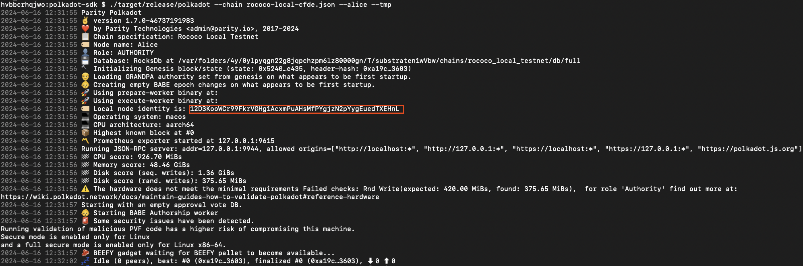

In order for the second node (Bob) to connect to Alice, you will need Alice's `local node identity address`. Check your logs and **copy** Alice's address.

In the second terminal, run the following command to start Bob's relay node

```bash
./target/release/polkadot --chain rococo-local-cfde.json --bob --tmp --port 30334 --bootnodes /ip4/127.0.0.1/tcp/30333/p2p/<ALICE_ADDRESS>
```

You should see a similar output to this:

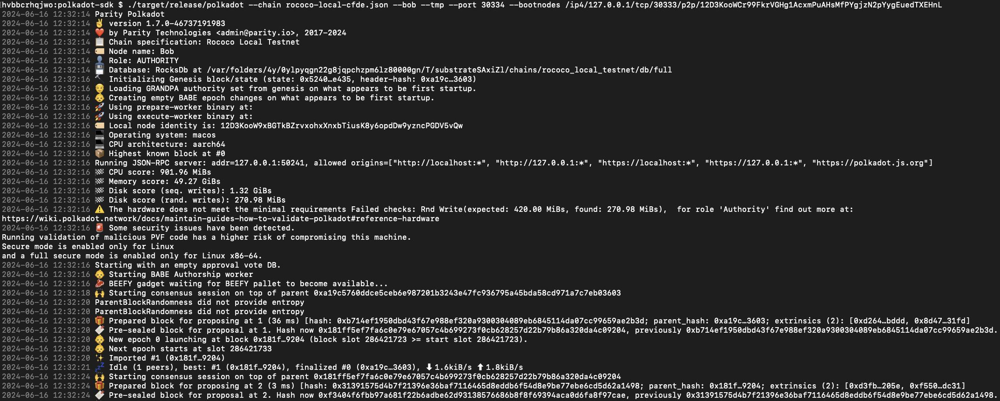

If the number of `finalized` blocks is increasing, this means your local Relay Chain network is producing new blocks and successfully reaching consensus.

## Build the Gosemble Parachain runtime

Now that you have started the Relay Chain, open another terminal to the default Gosemble directory.

The following command build the preconfigured runtime parachain template, found
[here](https://github.com/limechain/gosemble/runtime/templates/parachain/runtime.go).

```bash
make build-parachain-release
```

## Build the Parachain node

The next step is to build the parachain node.

The following command builds the Parachain node and uses the Gosemble runtime as a runtime.

```bash
make parachain-build
```

The first time will take around 10 minutes to complete the build.

## Create the Parachain chain specification and collator validation logic

Head to the `polkadot-sdk` subdirectory:

```bash
cd polkadot-sdk
```

Generate the parachain chainspec configuration:

```bash
./target/release/polkadot-parachain build-spec --disable-default-bootnode > plain-parachain-chainspec.json
```

Generate the raw specification:
```
./target/release/polkadot-parachain build-spec --chain plain-parachain-chainspec.json --disable-default-bootnode --raw > raw-parachain-chainspec.json
```

With the local Relay Chain running and the raw chain specification for the parachain template updated, 
you are ready to start the parachain collator node and export information about its runtime and genesis state.

The Relay Chain needs the parachain-specific runtime validation logic to validate parachain blocks. 
You can export the runtime for a parachain collator node by running a command similar to the following:

```bash
./target/release/polkadot-parachain export-genesis-wasm --chain raw-parachain-chainspec.json para-2000-wasm
```

Additionally, the Relay Chain needs to know the genesis state of the parachain. 
You can export the entire genesis state in a hex-encoded format by running a command similar to the following:

```bash
./target/release/polkadot-parachain export-genesis-state --chain raw-parachain-chainspec.json para-2000-genesis-state 
```

## Start the Parachain collator node

Open another terminal in the `polkadot-sdk` subdirectory.

In order for the collator to connect to the Relay Chain, you will need Alice's address. Copy Alice's address.

Replace **ALICE_ADDRESS** and execute the following command:

```bash
./target/release/polkadot-parachain \
--collator \
--alice \
--force-authoring \
--chain raw-parachain-chainspec.json \
--tmp --port 40333 --rpc-port 8844 \
-- --port 30343 --rpc-port 9977 \
--bootnodes /ip4/127.0.0.1/tcp/30333/p2p/ALICE_ADDRESS
```

You should see a similar output to this:

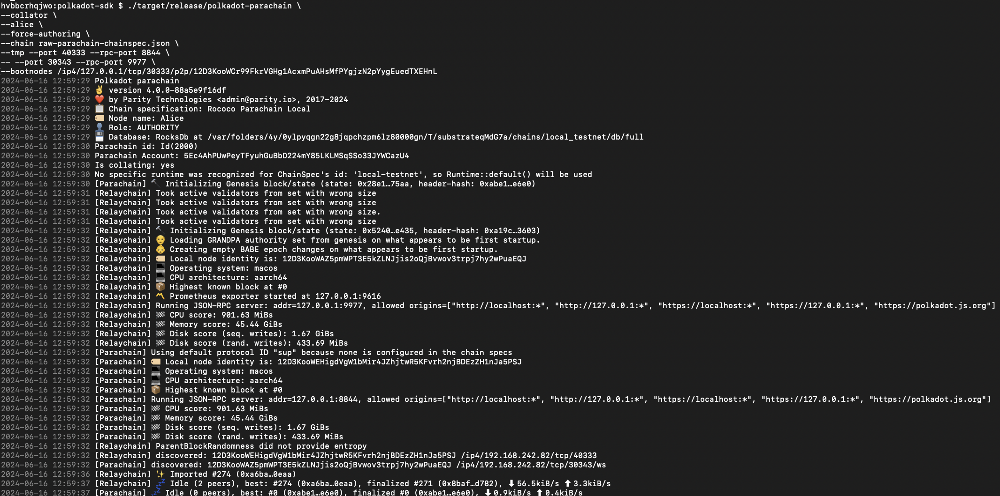


## Register the Parachain

With the local Relay Chain and collator node running, you are ready to connect the parachain on the local Relay Chain. 

For this tutorial, you can use a `Sudo` transaction and the **Polkadot/Substrate Portal**. 
Using a `Sudo` transaction enables you to bypass the steps required to acquire a parachain or parathread slot.

1. Open [https://polkadot.js.org/apps/](https://polkadot.js.org/apps/).
2. Click the **Polkadot** logo.
    
    
    
3. Switch to local network
    1. Scroll down to **Development** tab.
    2. Open the **Development** tab and select **Local Node**.
    3. Click **Switch**.

    

4. Relay Chain Local Network Explorer

    If your page is similar to the image below, you have successfully connected to your local Relay Chain node.

    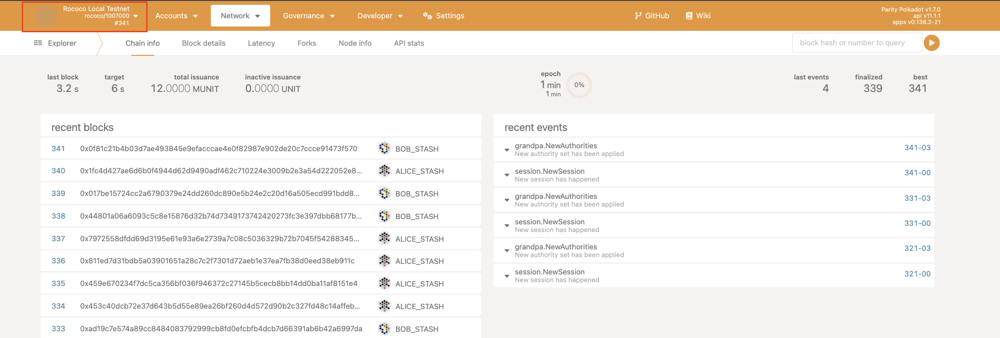

5. Reserve a Parathread slot

    1. Click **Network**
    2. Click **Parachains**
    3. Click **Parathreads**
    4. Click **ParaId**
        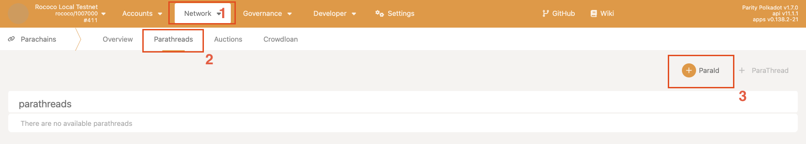
        1. Select **Alice**
        2. Click **Submit**
        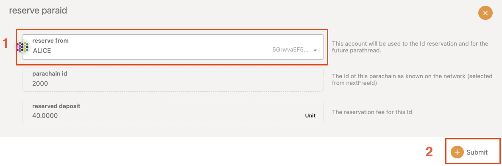
        3. Review the transaction and click **Sign and Submit**


## Initialize the Parachain
   
1. Click **Developer** and select **Sudo**.
    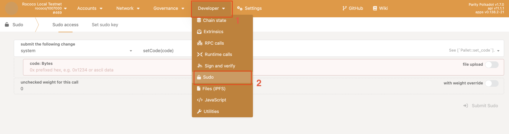

2. Select `parasSudoSwapper` and `sudoScheduleParaInitialize(id, genesis)`.
3. Execute the transaction:
    
    Fill the following parameters:
    
    1. `id`: 2000
    2. `genesisHead`: Click file upload and upload the genesis state you exported for the parachain - `para-2000-genesis` file.
    3. `validationCode`: Click file upload and upload the WebAssembly runtime you exported for the parachain - `para-2000-wasm` file.
    4. `paraKind`: Select `Yes`.
    5. Click **Submit Sudo**
    
    6. Review the transaction details and **Sign and Submit** the transaction.

4. Click **Network** and **Explorer**.

5. Check the list of recent events for successful `sudo.Sudid` and `paras.PvfCheckAccepted` and click the event to see details about the transaction.
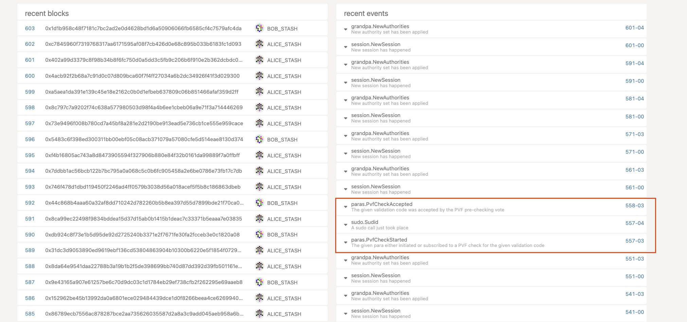

6. Wait for a new epoch to start. Then, the parachain will connect to the Relay Chain. The parachain collator node
should begin producing blocks.

    Check the Parachain terminal:
    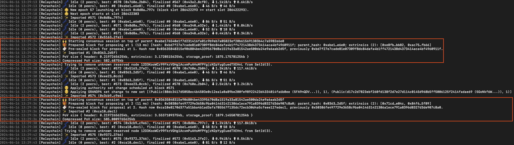

## Connect to the Parachain and Submit a transaction

Up to this point, you have used the Polkadot/Substrate Portal to connect to the local network and to
submit transactions to the local Relay Chain. 
Now that you have a Parachain running, which is connected to the Relay Chain, 
you can use the Polkadot/Substrate Portal to submit transactions to the Parachain.

1. Click the **Rococo Local Testnet** logo.
2. In **Development** tab, choose **Custom** and select `ws://127.0.0.1:8844`
3. Click **Switch**.
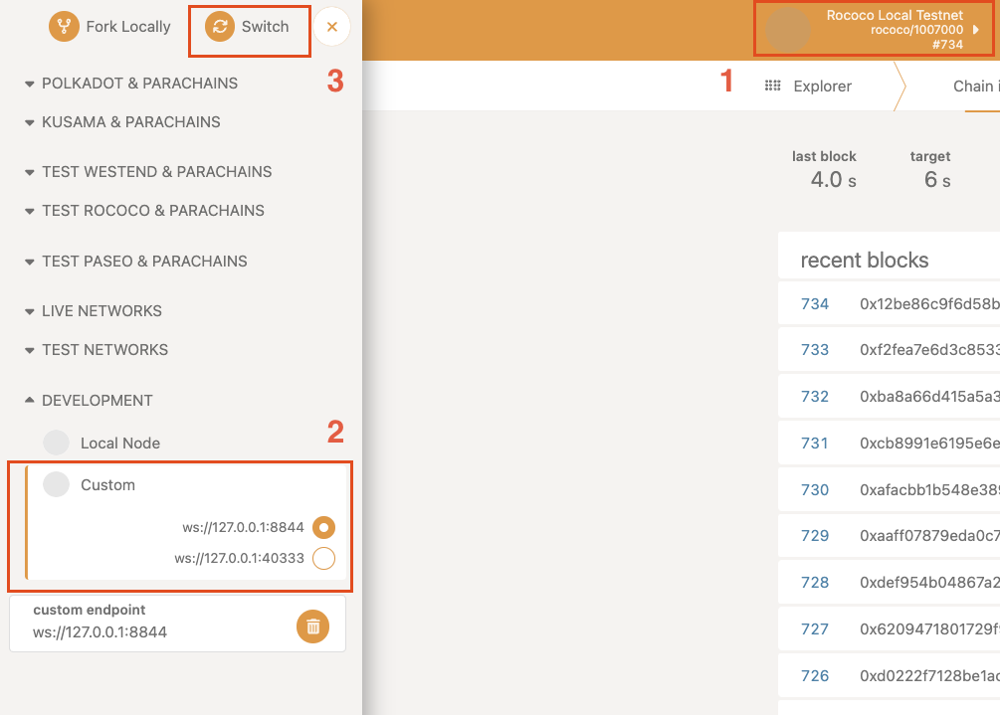

Now you are connected to the Parachain. The logo should say **Rococo Parachain Local**.
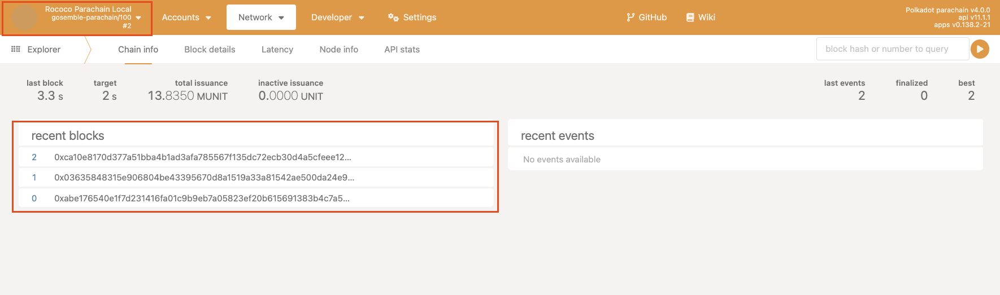

### Submit a transfer transaction

1. Hover over **Accounts** and click **Accounts**
2. Now you see the balances of all the accounts. Let's issue a transfer from **Alice**. 
3. Click **Send**

    Fill the following arguments and submit the transaction:

    1. Send to Address: `Charlie`
    2. Amount: `1000000`
    3. Click **Make Transfer**
    4. Review the transaction and then click **Sign and Submit**.

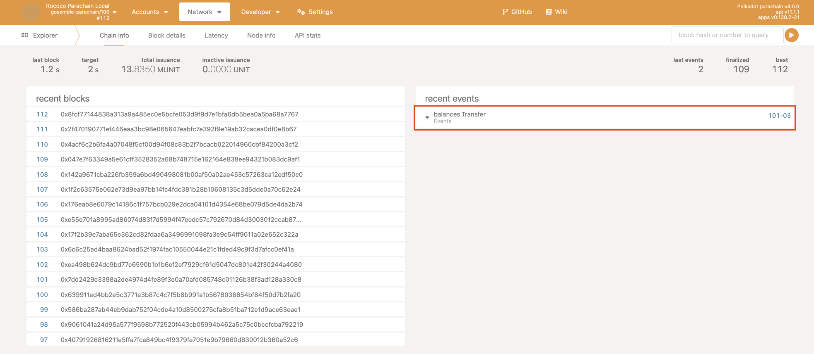

If the transaction was successful, you have a working parachain.

